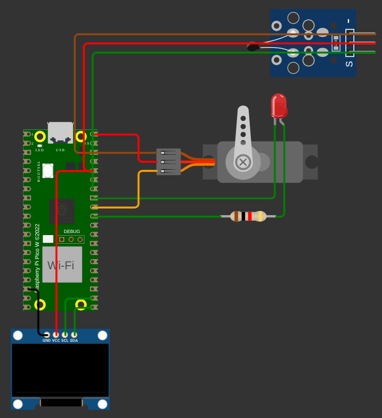
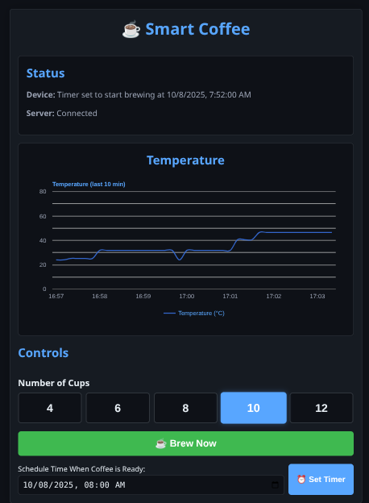

# Smart Coffee kahvin keittiminen IoT-pohjaiseen ohjaukseen

### tldr

Tämä projekti demonstroi yksinkertaista IoT-tietoputkea (“IoT pipeline”), jossa fyysinen laite (Raspberry Pi Pico W) kommunikoi pilvipalvelimen kautta web-käyttöliittymän kanssa reaaliajassa. Tämän projektin avulla perinteistä kahvinkeitintä voidaan ohjata etänä ja käynnistää ajastetusti.

- Kahvin keitto voidaan ajastaa tai käynnistää heti WebAppilla
- Picoon kytketty servo käynnistää kahvinkeittimen virtakytkimestä
- Kahvinkeittimen lämpötila mitataan NTC:llä, jotta voidaan varmistaa keittimen käynnistyminen
- Laitteen tilasta näytetään tietoa OLED-näytöllä
- Techstack: Pico W (MicroPython), Node.js/Express, SQLite, Vite, React, Socket.IO, MQTT, Google Graph

## Sisällysluettelo

- [Rakenne](#rakenne)
- [Järjestelmän kulku](#järjestelmän-kulku)
- [Pilvessä ajaminen](#pilvessä-ajaminen)
- [Paikallinen ajaminen](#paikallinen-ajaminen)
- [Wokwi-simulaattorin käyttö](#wokwi-simulaattorin-käyttö)
- [Keskeiset toiminnot laitteessa](#keskeiset-toiminnot-laitteessa)
- [HTTP-rajapinta (backend)](#http-rajapinta-backend)
- [Tallennus](#tallennus)
- [Ajatuksia ja jatkokehitystä](#ajatuksia-ja-jatkokehitystä)

## Rakenne

- Laite (Pico W, MicroPython)

  - Wokwi-kytkentä: [pico/diagram.json](pico/diagram.json)
  - Käynnistys ja pääsilmukka: [pico/main.py](pico/main.py)
  - Laitteen ohjauslogiikka: [`device_controller.DeviceController`](pico/device_controller.py)
  - MQTT-yhteys: [`dyiumqtt.MQTTClient`](pico/dyiumqtt.py) (Osittain tekoälyä käyttäen)
  - Wi-Fi-apurit: [`pico/wlan_utils.py`](pico/wlan_utils.py) (Osittain tekoälyä käyttäen)
  - Lämpötila-anturi (NTC): [`temperature_sensor.Thermometer`](pico/temperature_sensor.py)
  - Servon ohjaus: [`servo.ServoController`](pico/servo.py)
  - OLED-näyttö: [`oled_control.OledController`](pico/oled_control.py)
  - Asetukset (WLAN/MQTT/pinnit): [pico/config.py](pico/config.py)
  - ssd1306 - oled ohjuri: [`pico/wlan_utils.py`](pico/wlan_utils.py) (Osittain tekoälyä käyttäen)

    

- Backend (Node.js/Express + MQTT + SQLite + Socket.IO)

  - HTTP-palvelin ja Socket.IO: [backend/server.js](backend/server.js)
  - Reitit (REST API): [backend/routes.js](backend/routes.js)
  - MQTT-yhteys ja käskyt: [`mqttClient.initMqtt`](backend/mqttClient.js), [`mqttClient.sendCommand`](backend/mqttClient.js), [`mqttClient.sendCoffeeTimerToPico`](backend/mqttClient.js)
  - Lämpötilojen talletus ja tilapäivitykset: [`handlers.handleTemp`](backend/handlers.js), [`handlers.handleStatus`](backend/handlers.js)
  - SQLite-kanta (coffee_data.db) ja skeema: [`db.initDb`](backend/db.js)

- Frontend (Vite + React)

  - Sovelluksen juuri: [iot-frontend/src/App.jsx](iot-frontend/src/App.jsx)
  - Reaaliaikainen käyrä: [iot-frontend/src/components/Chart.jsx](iot-frontend/src/components/Chart.jsx)
  - Tila/Status-näkymä: [iot-frontend/src/components/StatusSection.jsx](iot-frontend/src/components/StatusSection.jsx)
  - Ohjaimet (brew now / timer): [iot-frontend/src/components/Controlls.jsx](iot-frontend/src/components/Controlls.jsx)
  - Ilmoitukset: [iot-frontend/src/components/Feedback.jsx](iot-frontend/src/components/Feedback.jsx)
  - Socket.IO-asiakas: [iot-frontend/src/socket.js](iot-frontend/src/socket.js)
  - API-osoiteenvit: [iot-frontend/.env.development](iot-frontend/.env.development), [iot-frontend/.env.production](iot-frontend/.env.production)

    

## Järjestelmän kulku

1. Pico W käynnistyy, yhdistää Wi-Fiin ja MQTT-välittäjään (test.mosquitto.org) ja tilaa/publisoi aiheet, jotka on määritelty: [`config.MQTT`](pico/config.py)
   - subscribe_topic: `iot/demo/commands`
   - publish_topic: `iot/demo/responses`
2. Lämpötilat luetaan NTC:stä ja julkaistaan viestinä `{"type":"TEMP","param":<arvo>}`: [`dyiumqtt.MQTTClient.publish`](pico/dyiumqtt.py).
3. Backend tilaa `iot/demo/responses`-aiheen, tallentaa lämpötilat SQLiteen ja emittoi niitä frontendille tapahtumana `temperature_update`: [`handlers.handleTemp`](backend/handlers.js).
4. Frontend näyttää viimeisen 10 min käyrän ja reaaliaikaiset päivitykset: [Chart.jsx](iot-frontend/src/components/Chart.jsx).
5. Käskyt (brew now / ajastus) lähtevät backendin REST-rajapinnan kautta → MQTT-komento Picolle:
   - `MAKE_COFFEE_NOW` tai `SET_TIMER`: [`routes.js`](backend/routes.js) → [`mqttClient.sendCommand`](backend/mqttClient.js) / [`mqttClient.sendCoffeeTimerToPico`](backend/mqttClient.js)
6. Laite ajaa servon ja päivittää tilaa OLED:lle sekä julkaisee statuksen (`STATUS`), jonka backend välittää UI:hin: [`handlers.handleStatus`](backend/handlers.js).

## Pilvessä ajaminen

Ohjelma on tällä hetkellä julkaistuna:

- Backend: [https://final-coffee-pipeline-backend.onrender.com](https://final-coffee-pipeline-backend.onrender.com) (Render)
- Frontend: [https://coffee-timer-beige.vercel.app/](https://coffee-timer-beige.vercel.app/) (Vercel)

Pipelinen toiminta vaatii luonnollisesti myös Pico W laitteen, joka on kytketty samaan MQTT-välittäjään (test.mosquitto.org:1883).

## Paikallinen ajaminen

- Backend
  - Hakemistossa `final_coffee_pipeline/backend`:
    - `npm install`
    - `node server.js` (portti 4000): [backend/server.js](backend/server.js)
- Frontend
  - Hakemistossa `final_coffee_pipeline/iot-frontend`:
    - Aseta `VITE_API_URL` osoittamaan backendisi osoitteeseen (esim. `http://localhost:4000`): [.env.development](iot-frontend/.env.development)
    - `npm install`
    - `npm run dev` ja avaa paikallinen Vite-osoite
- Pico (Wokwi)
  - Käynnistä simulaatio; varmista, että backend on käynnissä jos haluat talletuksen ja UI:n päivitykset.

## Wokwi-simulaattorin käyttö

##### HUOM!!

Ohjelman toiminta Wokwi simulaattorissa on melko epävakaata. Ajoittain simulaattorin sisäisten verkkovirheiden vuoksi ohjelma ei toimi odotetusti. Suosittelen kokeilemaan koodia oikealla laitteella, jos mahdollista.

- Simulaattori: [https://wokwi.com/](https://wokwi.com/)
- Tuo [pico/diagram.json](pico/diagram.json) ja muut tiedostot tyhjään Wokwi projektiin.
- Laite ajaa [pico/main.py](pico/main.py), joka käyttää [`device_controller.DeviceController`](pico/device_controller.py).
- WLAN-SSID on oletuksena Wokwi-GUEST: [pico/config.py](pico/config.py).
- MQTT-broker: test.mosquitto.org:1883 (julkinen).

## Keskeiset toiminnot laitteessa

- Ajastus ja aika
  - Ajan synkronointi pyydetään backendiltä (`GET_TIME`): [`device_controller.DeviceController.get_time_from_server`](pico/device_controller.py)
  - Ajastimen asetus tai välitön käynnistys: [`device_controller.DeviceController._set_timer`](pico/device_controller.py), `_make_coffee_now`
- OLED-tilapäivitykset 5 s välein: [`device_controller.DeviceController.update_oled_if_needed`](pico/device_controller.py)
- MQTT-yhteyden ylläpito ja ping: [`dyiumqtt.MQTTClient.loop`](pico/dyiumqtt.py), [`device_controller.DeviceController.ping_mqtt_if_needed`](pico/device_controller.py)

## HTTP-rajapinta (backend)

- GET `/status` — palauttaa palvelimen ja laitteen tilan sekä triggeröi `CHECK_STATUS`: [`server.getStatus`](backend/server.js), [routes.js](backend/routes.js)
- GET `/latest-temps` — viimeiset 10 min lämpötilat nousevassa aikajärjestyksessä: [routes.js](backend/routes.js)
- POST `/brew-now` body: `{ "cups": number }` — laskee keston ja lähettää `MAKE_COFFEE_NOW`: [routes.js](backend/routes.js)
- POST `/set-timer` body: `{ "datetime": isoString, "cups": number }` — säätää aloitusajan ja lähettää `SET_TIMER`: [routes.js](backend/routes.js)

## Tallennus

- SQLite-tietokanta `coffee_data.db` sijaitsee backend-kansiossa ja taulu luodaan automaattisesti: [`db.initDb`](backend/db.js).
- Tietokantaan tallennetaan lämpötilat tauluun `temperatures`:
  - sarakkeet: `id` (autoincrement), `timestamp` (ISO), `temperature` (float)
- Viimeiset 10 min lämpötilat haetaan `GET /latest-temps`: [`db.getLatestTemperatures`](backend/db.js)
- Live-lämpötilat välitetään myös Socket.IO:lla kaikille asiakkaille: [`socket.on("temperature", ...`](backend/socket.js)

## Ajatuksia ja jatkokehitystä

- Koodi on kirjoitettu nopeasti ja paikoin kankeasti. Parannuksia voisi tehdä erityisesti virheenkäsittelyyn, rakenteeseen ja dokumentointiin.
- Laiteohjelmisto on kirjoitettu MicroPythonilla, mutta C/C++:llä voisi saada paremman suorituskyvyn ja vakauden.
- MQTT-välittäjänä on käytetty julkista brokeria (test.mosquitto.org), mutta tuotantokäytössä oma tai kaupallinen brokeri olisi parempi.
- Tietoturva on jätetty lähes kokonaan huomioimatta. Salaus (TLS), autentikointi ja pääsynhallinta puuttuvat.
- Frontendin lähettämiin pyyntöihin ei ole lisätty validointia, acknowledgementia tai virheenkäsittelyä.
- Frontend on melko yksinkertainen. Käyttöliittymää voisi parantaa ja lisätä ominaisuuksia, kuten historiatiedot, tilaukset jne.

Kiitos, että tutustuit projektiin!
